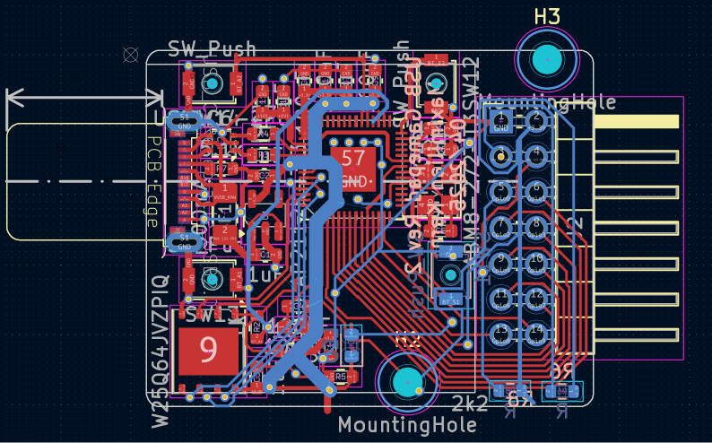
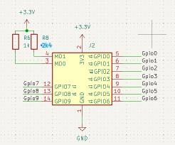
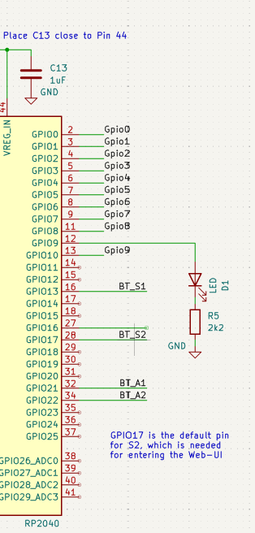
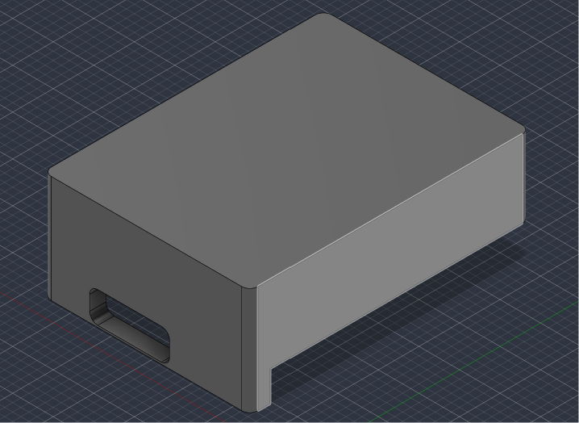

# USB Bridge Module 

A module that forwards controller input received over the console's J1 bus
out to a phone, laptop, or SBC as a standard USB HID gamepad.

Key features:
* Receives button/stick state from the console over UART (J1)
* Presents as a real USB HID gamepad to whatever it's plugged into
* Built on an unmodified, pre-routed RP2040 gamepad PCB design (not a
  from-scratch board).

## PCB
for the PCB, i used the DIY-Portrait-mode-Gamepad as a reference but eavily modified it to fit my needs

## Schematic

## 3D Case

## Bill of Materials (excluding console)

Also found in [bom.csv](./bom.csv).

| Item                                                  | Price per unit                      | Nr of units | Total price | Link                                               |
| ----------------------------------------------------- | ----------------------------------- | ----------- | ----------- | -------------------------------------------------- |
| PCB                                                   |                                     | 1           | 20$         | -                                                  |
| 2x7 2.54mm pin header (J1 breakout board)             | ~$0.20-0.39                         | 1           | ~$0.20-0.39 | https://www.aliexpress.com/item/4000186187780.html |
| 3-pin flying-lead connector (JST-PH or Dupont header) |     -                               | 1           | -           | -                                                  |
| MD0/MD1 ID resistors, 0603                            |      -                              | 2           | -           | -                                                  |
| USB-C cable (to phone/laptop/SBC)                     |       1$                            | 1           | -           | -                                                  |
| **Total**                                             |                                     |             | 22$         |                                                    |

## Credits

* PCB design, case design, and gamepad reference layout (flash/crystal/
  regulator/USB-C circuit): [CoretechR/DIY-Portrait-Mode-Gamepad](https://github.com/CoretechR/DIY-Portrait-Mode-Gamepad),
  by Maximilian Kern
* USB device HID gamepad firmware base: [TinyUSB](https://github.com/hathach/tinyusb),
  `examples/device/hid_composite/src/main.c`, by hathach and contributors
* Console-side UART driver pattern:   [`wardriving-driver`](https://docs.rs/crate/wardriving-driver) crate's UART bus usage
* Driver: [`xpanse_api`](https://docs.rs/xpanse-api)
* Thanks to Hack Club and the Hackxpansion team for the console platform this module plugs into: https://github.com/hackclub/hackxpansion
